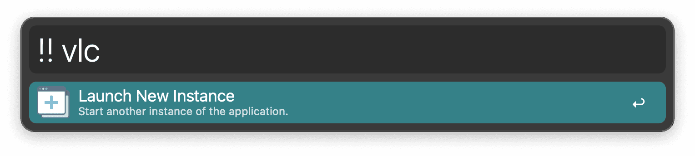
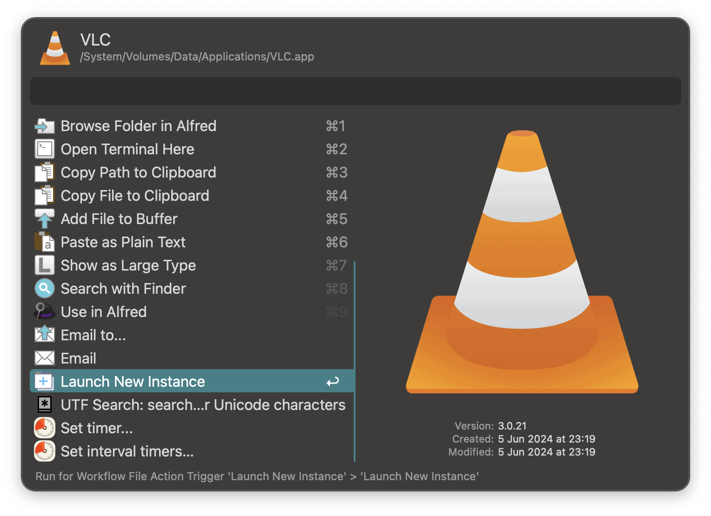

# Launch New Instance — Alfred Workflow

Quickly launch a **fresh process** of any macOS application—even if it’s already running.

> macOS normally brings the existing instance to front;
> this workflow forces a **new process** via `open -n -a`.

---

## Features

- **Minimal code:** single `open -n -a` call; no dependencies.
- **Alfred‑style icon:** readable on light/dark backgrounds.

### Keyword

`!! <AppName>` → spawns a new process of the app.


### Universal Action

`Launch New Instance` (available on Application results).


### Hotkey

Configurable in Alfred's workflow editor; acts on the selected app in Alfred and **skips** the Universal Actions list.

---

## Requirements

- **macOS** 12+ (earlier likely fine).
- **Alfred 5+** with **Powerpack** (Workflows feature).

---

## Installation

### Option A — Import the bundle (recommended)

1. Download the latest `.alfredworkflow` from Releases.
2. Double‑click to import into Alfred.

### Option B — Clone/symlink for development

```bash
# Clone wherever you keep code
git clone https://github.com/pmdci/alfred-launchnew.git

# Symlink into Alfred’s workflows dir (adjust path if needed)
ALFRED_DIR="$HOME/Library/Application Support/Alfred/Alfred.alfredpreferences/workflows"
ln -s "$HOME/Code/alfred-launchnew/src" \
   "$ALFRED_DIR/com.pedroinnecco.launchnew"
```

---

## Usage

### 1) Keyword

Type the keyword and the app name:

```text
!! Safari
!! VLC
!! Terminal
```

### 2) Universal Action

1. In Alfred, search for an app (e.g. _VLC_).
2. Press **Action** (`→` or `fn+Return`) to open Universal Actions.
3. Choose **Launch New Instance**.

### 3) Hotkey (fastest)

Assign a Hotkey in the workflow. With an app highlighted in Alfred, press your hotkey to spawn a new process immediately (skips the actions list).

---

## Configuration

Configuration is all done inside Alfred’s Workflow editor:

- **Keyword:** Open the workflow in Alfred Preferences and change the keyword (`!!` by default) to whatever you like.
- **Hotkey:** In the workflow, double-click the Hotkey object to assign your preferred shortcut.

---

## Troubleshooting & Notes

- **Some apps resist duplication.** A few apps are single‑instance by design (shared locks, self‑activation). Behaviour is app‑dependent.
- **Mac App Store sandboxing quirks.** If an app ignores `-n`, try launching by bundle path or with profile args (where supported).
- **Universal Actions ordering.** Built‑ins always appear first; workflow actions are grouped by type then alphabetised. Use the **Hotkey** to bypass the list.

---

## License

MIT License © 2025 Pedro Innecco

Refer to [LICENSE](LICENSE) file for more information.
